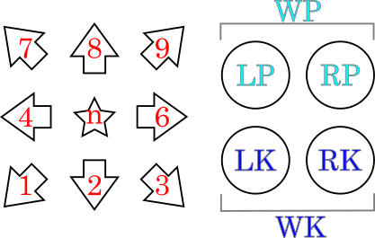

# Tekken game command imager

## Install / Requirement

Please install python 3.12 or later.
If you using Windows 10/11, you can find it on Microsoft store.

And, install modules.

```.sh
pip install -r requirements.txt
```

## Usage

Run command on your terminal.

```.sh
python tekken_command_image.py -o <output.png> 'commands'
```

Feature:

 * Commands are supporting Tenkey-style.
    * Directional `1234n6789`. See below.
    * Button `LP, RP, WP, LK, RK, WK`
    * Ignore case.
    * Slide syntax `[ ]` 
    * Command delimiter are `>` or `,`
    * You can use ` ` (white space). To improve visibility.

Directional-key and buttons:

```
 7 8 9   LP RP (Both punch is 'WP')
 4 n 6 
 1 2 3   LK RK (Both kick is 'WK')
```



### Example: Fujin-ken

```.sh
python tekken_command_image.py -o images/fujinken.png '6n23RK'
```


### Example: Zenshippo - Tekken 7

```.sh
python tekken_command_image.py -o images/zenshippo.png '6[lklp]'
```


### Example: Nina combo

```.sh
python tekken_command_image.py -o output.png '3RP > 9RK > 9LK > 3LKRP1RP > 66 > 3LKRP4RK > 66 > 236RKLKWP' 
```


## Limitation

 1. Currently, simultaneous button press notation (e.g. `LP+RK`) is not yet supported.

## License

GPLv3

## Notification

 * If you have any requests for additional features or report bugs, please submit them to Issues.
 * If you can donate through ko-fi, it will encourage my activities.

[](https://ko-fi.com/E1E1U0BU1)
